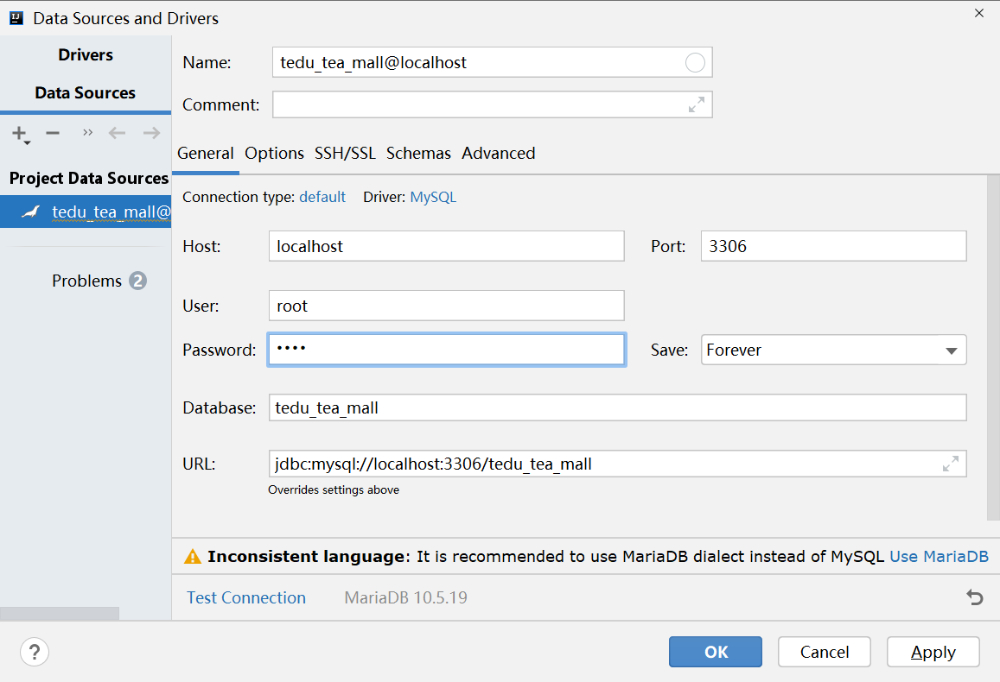

# 创建项目

创建参数如下：


在后续的创建向导界面中，选择使用Spring Boot 2.x系列的某个版本（暂时不推荐使用3.x系列版本），不需要勾选任何依赖项，直接完成创建即可！

创建完成后，首先，打开`pom.xml`，将依赖的父级项目版本改为`2.5.x`系列的版本。

然后，在`src/test/java`下找到默认存在的测试类，执行其中的无代码的测试方法，此测试方法应该通过成功执行，如果执行测试失败，则应该检查开发环境是否正确！

# 关于项目结构

当前项目需要区分出前台（普通用户使用的）和后台（管理或运营团队使用的）这2大类不同的项目，但是，又存在许多相同的部分（例如依赖项等），所以，应该将当前项目规划成聚合的Maven项目，大致是：

```
整个项目：tmall-server
-- 前台项目：tmall-front
-- 后台项目：tmall-admin
-- -- 账号管理后台项目：tmall-admin-account
-- -- 资讯管理后台项目：tmall-admin-content
-- -- 商城管理后台项目：tmall-admin-mall
-- 其它项目
```

所以，你需要：

- 删除`tmall-server`中的`src`（因为父项目不需要编写代码）及`target`（如果存在的话则删除）

- 对`tmall-server`项目名称点右键，通过`New` > `Module`来创建`tmall-admin`子模块项目

- 在`tmall-admin`的`pom.xml`中，将父级项目配置为`tmall-server`

- 在`tmall-server`的`pom.xml`中，需要配置：

  - 添加`<packaging>`标签，此标签默认值为`jar`，如果作为父级项目，则需要显式的配置为`pom`，例如：

    ```xml
    <packaging>pom</packaging>
    ```

  - 添加`<modules>`标签，显式的列举所有直接子级模块项目

    ```xml
    <modules>
    	<module>tmall-admin</module>
    </modules>
    ```

- 在`tmall-admin`的`pom.xml`中，不再需要配置：

  - `groupId`
  - `version`
  - `properties`
  - `build`

## 使用父项目管理依赖项

在父项目的`pom.xml`中配置的`<denpendencies>`中的所有依赖项，将可以被子级项目继承得到！

注意：通常不会在父项目中通过`<dependencies>`来添加依赖项，因为并不是所有的子项目都需要这里的每个依赖项！

通常，会在父项目中添加`<dependencyManagement>`标签，此标签的子级就是`<dependencies>`，例如：

```xml
<!-- 依赖管理 -->
<dependencyManagement>
    <!-- 管理的依赖项 -->
    <dependencies>
        <!-- Spring Boot的基础依赖项 -->
        <dependency>
            <groupId>org.springframework.boot</groupId>
            <artifactId>spring-boot-starter</artifactId>
            <version>2.5.0</version>
        </dependency>
        <!-- Spring Boot测试的依赖项 -->
        <dependency>
            <groupId>org.springframework.boot</groupId>
            <artifactId>spring-boot-starter-test</artifactId>
            <version>2.5.0</version>
        </dependency>
    </dependencies>
</dependencyManagement>
```

使用`<dependencyManagement>`时，子级项目并不会继承得到这些依赖项，但是，在`<dependencyManagement>`中应该显式的配置各依赖项的版本，然后，在子级项目中添加依赖时，不再指定各依赖项的版本号！

所以，`<dependencyManagement>`的作用就是用于管理所有依赖项的版本的！

并且，所有依赖项的版本，推荐配置在`<properties>`中，例如：

```xml
<!-- 属性配置 -->
<properties>
    <java.version>1.8</java.version>
    <spring-boot.version>2.5.0</spring-boot.version>
</properties>
```

然后，在各依赖项的管理代码中，使用`${}`引用以上的配置值即可，例如：


完成后，使用相同的模式，在`tmall-admin`下创建`tmall-admin-mall`项目。

# 创建数据库与数据表

登录MySQL / MariaDB客户端，创建`tedu_tea_mall`数据库：

```sql
CREATE DATABASE tedu_tea_mall;
```

在IntelliJ IDEA中配置Database面板，连接到以上数据库：



将创建数据表的SQL脚本（`create_table_mall.sql`）中的全部代码复制并粘贴到Console中，全部选中并执行，即可创建商城相关的数据表：


# 项目的开发流程

首先，你应该列举当前项目中涉及的数据类型，以本项目为例，数据类型有：商品类别，审核日志，评论，商品，商品详情，订单，订单项（订单中包含的商品），收货地址

然后，分析以上各数据类型的开发顺序，通常，应该先开发基础数据，且先开发简单的数据，例如，以上数据类型的开发顺序可以排列为：商品类别 > 商品 + 商品详情 > 审核日志 > 收货地址 > 订单 + 订单项 > 评论

接下来，应该分析各数据类型涉及的业务功能，以商品类别为例，应该包括：新增类别，删除类别，修改类别，根据ID查询类别，根据父级查询子级类别列表，启用和禁用，显示和隐藏

关于以上业务功能，其开发顺序大致遵循：增 > 查（列表）> 删 > 改，所以，以上各业务功能的开发顺序应该是：新增类别 > 根据父级查询子级类别列表 > 根据ID查询类别 > 删除类别 > 启用和禁用 > 显示和隐藏 > 修改类别

无论是哪个业务功能，代码的开发顺序几乎都是（不考虑中间件的情况下）：Mapper > Repository > Service > Controller > 页面


所以，当下短期的开发目标应该是：

- 新增类别 -- Mapper 
- 新增类别 -- Repository 
- 新增类别 -- Service 
- 新增类别 -- Controller 
- 新增类别 -- 页面
- 根据父级查询子级类别列表 -- Mapper 
- 根据父级查询子级类别列表 -- Repository 
- 根据父级查询子级类别列表 -- Service 
- 根据父级查询子级类别列表 -- Controller 
- 根据父级查询子级类别列表 -- 页面
- …… ……

# 添加数据库编程的相关依赖项

数据库编程的相关依赖项主要有：

- `mysql`
- `mybatis-spring-boot-starter`
- `lombok`（用于简化编写POJO类）
- `druid-spring-boot-starter`（Druid数据库连接池）
- `mybatis-plus-boot-starter`（MyBatis Plus整合Spring Boot）

则先在`tmall-server`的`pom.xml`添加依赖管理的相关代码：

```xml
<!-- 属性配置 -->
<properties>
    <java.version>1.8</java.version>
    <spring-boot.version>2.5.0</spring-boot.version>
    <mybatis-spring-boot.version>2.2.2</mybatis-spring-boot.version>
    <mybatis-plus-spring-boot.version>3.3.0</mybatis-plus-spring-boot.version>
    <druid-spring-boot.version>1.2.16</druid-spring-boot.version>
    <mysql.version>8.0.27</mysql.version>
    <lombok.version>1.18.20</lombok.version>
</properties>
```

```xml
<!-- Mybatis整合Spring Boot的依赖项 -->
<dependency>
    <groupId>org.mybatis.spring.boot</groupId>
    <artifactId>mybatis-spring-boot-starter</artifactId>
    <version>${mybatis-spring-boot.version}</version>
</dependency>
<!-- Mybatis Plus整合Spring Boot的依赖项 -->
<dependency>
    <groupId>com.baomidou</groupId>
    <artifactId>mybatis-plus-boot-starter</artifactId>
    <version>${mybatis-plus-spring-boot.version}</version>
</dependency>
<!-- Alibaba Druid数据库连接池 -->
<dependency>
    <groupId>com.alibaba</groupId>
    <artifactId>druid-spring-boot-starter</artifactId>
    <version>${druid-spring-boot.version}</version>
</dependency>
<!-- MySQL的依赖项 -->
<dependency>
    <groupId>mysql</groupId>
    <artifactId>mysql-connector-java</artifactId>
    <version>${mysql.version}</version>
</dependency>
<!-- Lombok的依赖项，主要用于简化POJO类的编写 -->
<dependency>
    <groupId>org.projectlombok</groupId>
    <artifactId>lombok</artifactId>
    <version>${lombok.version}</version>
</dependency>
```

再在`tmall-admin-mall`的`pom.xml`添加需要使用的依赖项：

```xml
<!-- Mybatis整合Spring Boot的依赖项 -->
<dependency>
    <groupId>org.mybatis.spring.boot</groupId>
    <artifactId>mybatis-spring-boot-starter</artifactId>
</dependency>
<!-- Mybatis Plus整合Spring Boot的依赖项 -->
<dependency>
    <groupId>com.baomidou</groupId>
    <artifactId>mybatis-plus-boot-starter</artifactId>
</dependency>
<!-- Alibaba Druid数据库连接池 -->
<dependency>
    <groupId>com.alibaba</groupId>
    <artifactId>druid-spring-boot-starter</artifactId>
</dependency>
<!-- MySQL的依赖项 -->
<dependency>
    <groupId>mysql</groupId>
    <artifactId>mysql-connector-java</artifactId>
</dependency>
<!-- Lombok的依赖项，主要用于简化POJO类的编写 -->
<dependency>
    <groupId>org.projectlombok</groupId>
    <artifactId>lombok</artifactId>
</dependency>
```

提示：由于还没有配置连接数据库的参数，所以，当添加以上依赖项后，执行测试将出现异常！

需要在`application.properties`中添加配置：

```properties
# 连接数据库的配置
spring.datasource.url=jdbc:mysql://localhost:3306/tedu_tea_mall?useUnicode=true&characterEncoding=utf-8&serverTimezone=Asia/Shanghai
spring.datasource.username=root
spring.datasource.password=root
```

由于Spring Boot只会在启动或执行测试时读取以上信息，并不会连接到数据库服务器，所以，即使配置信息错误，也可以成功启动项目或测试通过！

可以在基于Spring Boot的测试类中编写代码：

```java
@Autowired
DataSource dataSource;

@Test
void getConnection() throws Exception {
    dataSource.getConnection();
}
```

通过以上测试方法，可以检查配置信息是否正确！

# 关于数据库连接池

在Spring Boot项目中，当添加了数据库编程的依赖项后，会自动配置并启用`Hikari`数据库连接池！

也可以按需替换为其它数据库连接池，例如，当添加了`druid-spring-boot-starter`依赖项后，不需要添加或修改任何代码，会自动切换为`Druid`数据库连接池。

典型的数据库连接池有：`commons-dbcp` / `commons-dbcp2` / `tomcat` / `Hikari` / `Druid`等

提示：如果添加的数据库连接池的依赖项的`artifactId`并没有`spring-boot-starter`字样，例如添加的就是`druid`，则需要在`application.properties`中配置，例如：

```properties
spring.datasource.type=com.alibaba.druid.pool.DruidDataSource
```

关于数据库连接池的配置参数：

```properties
# Druid数据库连接池的配置：初始化连接数
spring.datasource.druid.initial-size=2
# Druid数据库连接池的配置：最大激活数量
spring.datasource.druid.max-active=5
```

# 关于Profile配置

在项目中，许多配置值会因为环境的变化需要调整，例如，同一个属性，在开发环境、测试环境、生产环境中，配置值可能是不同的！

Spring框架支持Profile配置，Spring Boot简化了对于Profile配置的使用，在Spring Boot项目中，`application.properties`是始终会加载的配置文件，开发者可以自行创建更多文件名为`application-自定义名称.properties`的配置文件，这些文件就是Profile配置文件，默认是不加载的，需要在`application.properties`中通过`spring.profiles.active`属性显式的激活才会生效！


提示：如果`application.properties`与激活的配置文件中存在相同的属性，但值不同，以Profile配置文件中的配置值为准！

提示：在`spring.profiles.active`属性上，可以配置多个值，使用逗号分隔即可，如果激活的多个Profile配置文件中存在相同的属性且值不同，以`spring.profiles.active`属性值中偏右侧激活的文件为准

# 关于YAML配置

Spring框架默认并不支持YAML配置，需要添加`snakeyaml`工具包才可以解析此配置文件，在Spring Boot的基础依赖项中，已经包含此工具包，所以，在Spring Boot项目中，可以直接使用YAML配置。

YAML配置是一种编写配置文件的语法，这类配置文件将使用`.yaml`或`.yml`作为扩展名，其语法特征为：

- 属性名与属性值之间使用1个冒号和1个空格进行分隔
- 属性名中原本使用小数点分隔的部分，改为使用冒号+换行+缩进2个空格
- 如果多个属性的名称有相同的前缀，则不必反复写相同的部分，只需要保持相同的缩进即可

假设原本存在`.properties`配置：

```properties
spring.datasource.url=jdbc:mysql://localhost:3306/tedu_tea_mall?useUnicode=true&characterEncoding=utf-8&serverTimezone=Asia/Shanghai
spring.datasource.username=root
spring.datasource.password=root
```

改为YAML配置：

```yaml
spring:
  datasource:
    url: jdbc:mysql://localhost:3306/tedu_tea_mall?useUnicode=true&characterEncoding=utf-8&serverTimezone=Asia/Shanghai
    username: root
    password: root
```

提示：使用YAML配置时，属性名中的小数点并不一定需要替换为冒号+回车+缩进

注意：YAML配置对语法要求非常严格，甚至对标点符号要求也非常严格，如果YAML文件解析失败，需要检查整个文件

# 关于MyBatis Plus

MyBatis Plus是一款由国人开发的基于MyBatis的无侵入性的框架。

在Spring Boot中，在已经添加MyBatis编程相关的依赖项后，补充添加`mybatis-plus-boot-starter`即可在项目中使用MyBatis Plus。

就像使用MyBatis那样，你需要先准备一个配置类，通过`@MapperScan`来指定Mapper接口的包，例如：

```java
@Configuration
@MapperScan("cn.tedu.tmall.admin.mall.dao.persist.mapper")
public class MyBatisConfiguration {
}
```

然后，以对应的包下创建Mapper接口文件，例如：

```java
package cn.tedu.tmall.admin.mall.dao.persist.mapper;

import org.springframework.stereotype.Repository;

@Repository
public interface CategoryMapper {
}
```

当使用了MyBatis Plus后，你应该让自己的Mapper接口继承自MyBatis Plus提供的`BaseMapper`接口，关于`BaseMapper`接口：


当自定义的Mapper接口继承自`BaseMapper`后，可以直接使用以上所有方法实现数据访问！

注意：使用`BaseMapper`时，需要指定其声明的泛型类型，此类型就是当前你需要访问的数据表对应的实体类型！

所以，还需要自行创建数据表对应的实体类，例如：

```java
/**
 * 实体类：商品-类别
 *
 * @author YiRunDong
 * @version 2.0
 */
@Data
public class Category implements Serializable {

    /**
     * 数据ID
     */
    private Long id;

    /**
     * 类别名称
     */
    private String name;

    /**
     * 父级类别ID，如果无父级，则为0
     */
    private Long parentId;

    /**
     * 深度，最顶级类别的深度为1，次级为2，以此类推
     */
    private Integer depth;

    /**
     * 关键词列表，各关键词使用英文的逗号分隔
     */
    private String keywords;

    /**
     * 排序序号
     */
    private Integer sort;

    /**
     * 图标图片的URL
     */
    private String icon;

    /**
     * 是否启用，1=启用，0=未启用
     */
    private Integer enable;

    /**
     * 是否为父级（是否包含子级），1=是父级，0=不是父级
     */
    private Integer isParent;

    /**
     * 是否显示在导航栏中，1=启用，0=未启用
     */
    private Integer isDisplay;

    /**
     * 数据创建时间
     */
    private LocalDateTime gmtCreate;

    /**
     * 数据最后修改时间
     */
    private LocalDateTime gmtModified;

}
```

准备好实体类后，使得自定义的Mapper接口继承自`BaseMapper`，例如：

```java
package cn.tedu.tmall.admin.mall.dao.persist.mapper;

import cn.tedu.tmall.admin.mall.pojo.entity.Category;
import com.baomidou.mybatisplus.core.mapper.BaseMapper;
import org.springframework.stereotype.Repository;

@Repository
public interface CategoryMapper extends BaseMapper<Category> {
}
```

注意：当使用`BaseMapper`时传入了实体类型后，MyBatis Plus会根据实体类的名称得到数据表名称，例如实体类名为`Category`，则MyBatis Plus认为对应的数据表名称就是`category`，如果需要自行指定数据表名称，需要在实体类上添加`@TableName`注解进行配置，例如：

```java
@Data
@TableName("mall_category")
public class Category implements Serializable {
    // ...
}
```

在插入数据时，MyBatis Plus有自己的ID编号规则，并不是从1开始自动编号的，如果需要使用自动编号的ID，需要在主键对应的属性上配置`@TableId`注解，例如：

```java
@Data
@TableName("mall_category")
public class Category implements Serializable {

    /**
     * 数据ID
     */
    @TableId(type = IdType.AUTO) // 自动编号，步长为1
    private Long id;
    
    // ...
    
}
```

经过以上配置后，新插入的数据会在现有的最大ID值基础上自增1，得到新的ID值！

注意：如果插入数据的表的主键是自动编号的，当成功插入数据后，MyBatis Plus会获取新数据的自动编号ID值，并存入到参数对象中与主键对应的属性（通常是`id`属性）上，即：

```java
@Test
void insert() {
    Category category = new Category();
    category.setName("测试的类别的名称");
    System.out.println("插入数据之前，参数：" + category);
    int rows = mapper.insert(category);
    System.out.println("受影响的行数：" + rows);
    System.out.println("插入数据之后，参数：" + category); // 参数的id是有值的
}
```

MyBatis Plus提供的许多方法都可以使用`Wrapper`类型的参数，其简单使用方式如下：

```java
@Test
void delete() {
    // eq >>> equals
    // ne >>> not equals
    // lt >>> less than
    // gt >>> greater than
    QueryWrapper<Category> wrapper = new QueryWrapper<>();
    wrapper.lt("id", 15);
    int rows = mapper.delete(wrapper);
    System.out.println("受影响的行数：" + rows);
}
```

使用`QueryWrapper`时，可以用于指定条件的方法都来自其父类`AbstractWrapper`，大致包括：


