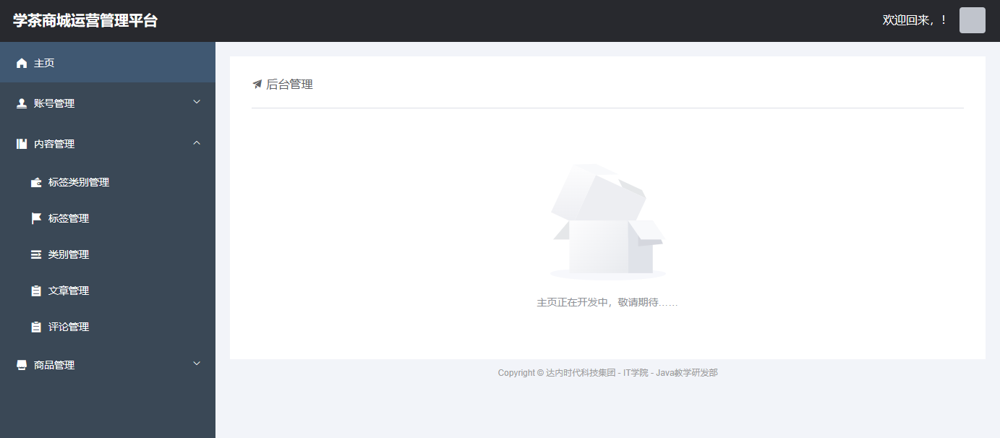

# 关于VUE Cli项目

VUE Cli创建的项目通常称之为“VUE脚手架项目”。

VUE Cli项目是一种单页面的项目，在这种项目中，只有1个HTML文件！具体的内容显示是由各个`.vue`文件（视图组件文件）来实现的，每个显示效果都可能是由多个`.vue`共同组成的，每个`.vue`的显示位置也可以轻松替换为另一个`.vue`文件的显示效果，就可以实现“搭积木”的方式来构建页面！

# 关于VUE Cli项目的结构

- `[.idea]`：由IntelliJ IDEA打开的项目都有此文件夹，是由IntelliJ IDEA维护的，不需要手动管理，如果此文件夹下的文件出错，删除即可，后续IntelliJ IDEA会自动重新创建所需的文件
- `[node_modules]`：当前项目的所有依赖项，此文件夹通常会被配置到`.gitignore`文件中，如果项目中缺少此文件夹，或缺少此文件夹下的部分依赖项，都可能导致项目无法正常使用，需要通过`npm install`命令来安装相关软件（下载必要的依赖项），此命令会根据`package.json`中配置的依赖列表来下载各依赖项
- `[public]`：项目的静态资源文件夹，用于存放`.html`、`.css`、`.js`、图片等静态资源，在具体使用时，可以按需自行创建文件夹来管理各文件，在访问时，此文件夹相当于主机的根路径，例如在`public`下直接存放`a.jpg`，访问路径则是`http://localhost:8080/a.jpg`
  - `favicon.ico`：图标文件
  - `index.html`：当前项目唯一的HTML文件
- `[src]`：源代码
  - `[assets]`
  - `[components]`
  - `[router]`：路由配置文件的文件夹
    - `index.js`：默认的路由配置文件
  - `[store]`
  - `[views]`：存放视图组件的文件夹
  - `App.vue`：默认会被注入到`index.html`中的视图组件
  - `main.js`：当前项目的主要配置文件
- `.gitignore`：用于配置使用GIT仓库时忽略的文件或文件夹，在此文件中配置的文件、文件夹均不会被提交到GIT仓库
- `babel.config.js`：~
- `jsconfig.json`“：~
- `package.json`
- `package-lock.json`
- `vue-config.js`：~

# 关于视图组件

在VUE Cli项目中，以`.vue`作为扩展名的文件就是视图组件文件，这类文件通常可能包含：

- `<template>`：用于设计页面中的元素
  - 注意：此标签只能有1个直接子标签
- `<script>`：用于编写JavaScript程序
- `<style>`：用于编写CSS样式

# 关于路由配置

在VUE Cli项目中，`src/router/index.js`是默认的路由配置文件，此文件中配置了“路径”与“视图组件”的映射关系。

默认的配置如下：

```java
import HomeView from '../views/HomeView.vue'

const routes = [
  {
    path: '/',
    name: 'home',
    component: HomeView
  },
  {
    path: '/about',
    name: 'about',
    component: () => import('../views/AboutView.vue')
  }
]
```

以上`routes`常量是数组类型的，其中的元素是对象，每个对象都是一个“路由对象”！

在路由对象中，`path`表示访问路径，`component`表示视图组件，`name`是可以缺省的！

其中，`component`属性的值可以是通过`import`语句来导入某个视图组件，也可以通过`import()`函数来导入某个视图组件。

# 关于`<router-view/>`标签

在VUE Cli项目中，在视图组件中可以添加`<router-view/>`标签，表示此标签所在的位置将由其它视图组件来完成显示及对应的功能！具体由哪个视图组件来显示，取决于路由配置！

# 使用Element UI

在VUE Cli项目中，当需要使用Element UI时，需要先在当前项目中安装，安装命令为：

```
npm i element-ui -S
```

并且，在`main.js`中补充添加配置：

```javascript
import ElementUI from 'element-ui';
import 'element-ui/lib/theme-chalk/index.css';

Vue.use(ElementUI);
```

至此，配置完成，并且，整个项目的任何视图组件都可以直接使用Element UI。

# 设计登录页


# 作业

在客户端项目中，将原`HomeView`的内容调整为以下显示效果：



注意：提交作业时，将压缩包中的`node_modules`文件夹删掉再上传！

作业提交截止时间：明天(07.08)上午09:00。


