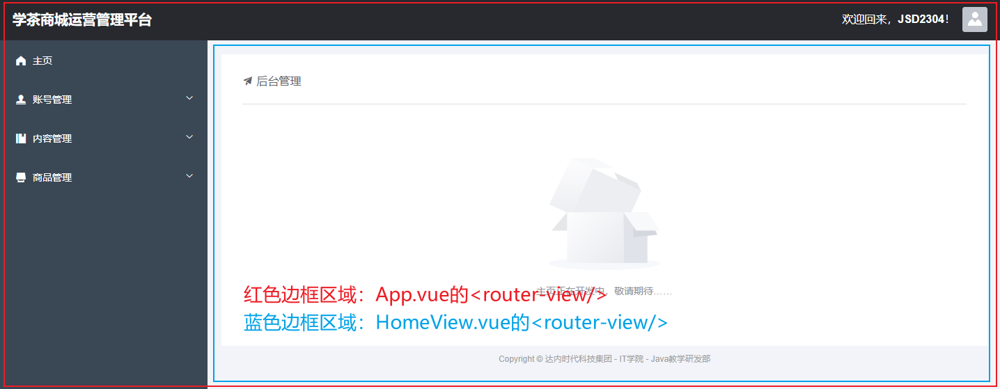
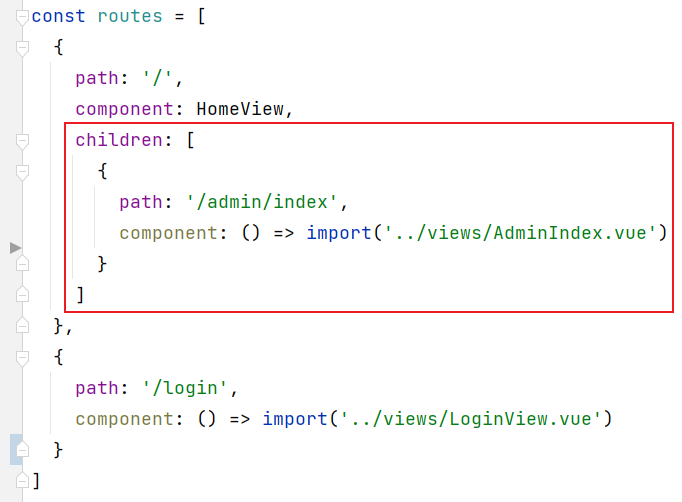

# 关于跨域访问

服务器端默认不允许异步的跨域请求。

> 关于跨域：只要主机名、端口号、通讯协议中的任何一项不同，即为跨域访问。

跨域访问导致的错误信息中，关键字为：CORS。完整的错误信息大致如下：

```
Access to XMLHttpRequest at 'http://localhost:8080/v1/users/login' from origin 'http://localhost:8081' has been blocked by CORS policy: Response to preflight request doesn't pass access control check: No 'Access-Control-Allow-Origin' header is present on the requested resource.
```

在基于Spring MVC的服务器端项目中，可以自定义配置类，实现`WebMvcConfigurer`接口，重写其中的`addCorsMappings()`方法，以配置允许的跨域访问！

简单的配置如下：

```java
import lombok.extern.slf4j.Slf4j;
import org.springframework.context.annotation.Configuration;
import org.springframework.web.servlet.config.annotation.CorsRegistry;
import org.springframework.web.servlet.config.annotation.WebMvcConfigurer;

/**
 * Spring MVC配置类
 *
 * @author YiRunDong
 * @version 2.0
 */
@Slf4j
@Configuration
public class WebMvcConfiguration implements WebMvcConfigurer {

    public WebMvcConfiguration() {
        log.debug("创建配置类对象：WebMvcConfiguration");
    }

    @Override
    public void addCorsMappings(CorsRegistry registry) {
        registry.addMapping("/**")
                .allowedHeaders("*")
                .allowedMethods("*")
                .allowedOriginPatterns("*")
                .allowCredentials(true)
                .maxAge(3600);
    }

}
```

# 在VUE Cli项目中使用axios

首先，需要安装axios，安装命令为：

```
npm i axios -S
```

然后，在`main.js`中添加配置：

```javascript
import axios from 'axios';

Vue.prototype.axios = axios;
```

登录示例：

```javascript
submitForm(formName) {
  this.$refs[formName].validate((valid) => {
    if (valid) {
      let url = 'http://localhost:8080/v1/users/login';
      console.log('url = ' + url);

      this.axios.post(url, this.ruleForm).then((response) => {
        let jsonResult = response.data;
        if (jsonResult.code == 1) {
          this.$message({
            message: '登录成功！',
            type: 'success'
          });
        } else {
          this.$alert(jsonResult.msg, '错误', {
            confirmButtonText: '确定',
            callback: action => {
            }
          });
        }
      });
    } else {
      return false;
    }
  });
}
```

# 嵌套路由

在VUE Cli项目中，只要访问“非静态资源”，都会认为你尝试访问`index.html`，则会由`App.vue`注入到页面中，而`App.vue`基本上是通过`<router-view/>`由其它视图组件来完成显示的，其它视图组件中可能也包含`<router-view/>`，就出现了`<router-view/>`的嵌套，则在配置路由时，也需要配置嵌套的路由！

例如：



在`src/router/index.js`中配置路由时，如果某个视图组件使用到了`<router-view/>`，则可以在对应的路由对象中添加`children`属性，此属性的配置方式与`routes`常量完全相同，例如：



简单理解：

- 如果把路由对象配置在`routes`常量中，此视图组件将显示在`App.vue`的`<router-view/>`位置
- 如果把路由对象配置在某个路由的`children`中，此视图组件将显示在此路由对应的视图组件的`<router-view/>`位置

需要注意：由于`HomeView`中设计了`<router-view/>`，则`HomeView`是一个不完整的View，不应该允许直接访问，可以在当前路由对象上添加`redirect`属性，表示“重定向”，即：当尝试访问`HomeView`时，直接重定向（跳转）到另一个视图组件


