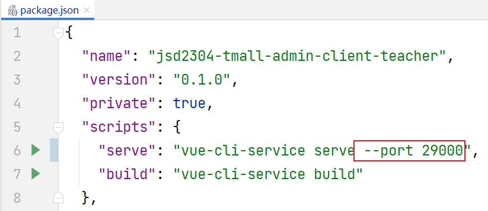
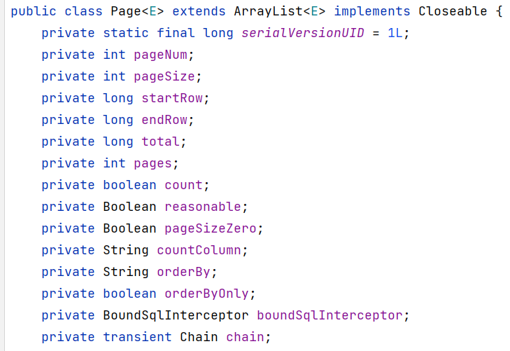

# 在VUE Cli项目中使用qs

qs是前端技术中，可以实现“对象与FormData格式的字符串”的转换的工具包！

安装命令为：

```
npm i qs -S
```

并且，需要在`main.js`中补充配置：

```javascript
import qs from 'qs';
Vue.prototype.qs = qs;
```

然后，就可以在视图组件中，通过`qs`将对象转换成FormData格式的字符串，例如：

```javascript
let formData = this.qs.stringify(this.ruleForm);
console.log('formData = ' + formData);
```

# 指定服务端口

在Spring Boot项目中，可以通过配置文件中的`server.port`属性指定端口号，例如：

```yaml
server:
  port: 28182
```

在VUE Cli项目中，可以通过`package.json`中的`scripts`属性的`serve`属性值修改端口号，在原值的基础上添加`--port 新端口号`即可，例如：



# 关于PageHelper框架

PageHelper框架是专门用于MyBatis的无侵入性的分页框架（是通过MyBatis拦截器实现的）。

在Spring Boot项目中，需要添加`pagehelper-spring-boot-starter`依赖项后才可以使用PageHelper框架：

```xml
<pagehelper-spring-boot.version>1.3.0</pagehelper-spring-boot.version>
```

```xml
<!-- 基于MyBatis或MyBatis Plus的分页查询框架 -->
<dependency>
    <groupId>com.github.pagehelper</groupId>
    <artifactId>pagehelper-spring-boot-starter</artifactId>
    <version>${pagehelper-spring-boot.version}</version>
</dependency>
```

然后，如果项目中已经使用MyBatis / MyBatis Plus实现了列表查询功能，就可以直接开始处理分页，例如：

```java
@SpringBootTest
public class PageHelperTests {

    @Autowired
    CategoryMapper mapper;

    @Test
    void listByParent() {
        Integer pageNum = 1; // 第几页
        Integer pageSize = 6; // 每页几条
        Long parentId = 0L;
        PageHelper.startPage(pageNum, pageSize); // 设置分页，注意：这句话必须直接出现在查询之前，否则可能导致线程安全问题
        List<?> list = mapper.listByParent(parentId);
        for (Object item : list) {
            System.out.println(item);
        }
    }

}
```

注意：以上调用`PageHelper.startPage()`与Mapper的查询，必须是连续的2条语句，否则，可能导致线程安全问题！

当通过PageHelper执行分页查询后，查询返回的集合将是`com.github.pagehelper.Page`类型的，是`ArrayList`的子级类型，并且，其中包含了许多分页的相关数据：



由于使用MyBatis查询列表时，抽象方法的返回值类型都会声明为`List`类型，则获取的返回结果不利于从中获取以上分页相关数据，为了便于获取以上分页数据，还应该结合PageHelper框架中的`PageInfo`类一起使用，将查询结果作为`PageInfo`的构造方法参数传入即可，再调用`PageInfo`对象的方法获取数据，例如：

```java
PageInfo<?> pageInfo = new PageInfo<>(list);
System.out.println("数据总量：" + pageInfo.getTotal());
System.out.println("总页数：" + pageInfo.getPages());
```


