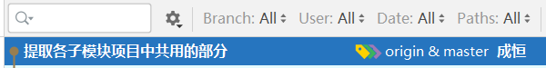

# 提取各子模块项目中共用的部分

多个子模块项目可能使用到相同的类，反复编写这些类是没有必要的！所以，应该将这些类提取到专门的子模块项目中，其它子模块项目直接依赖它即可！

则在根项目下创建`tmall-common`子模块项目，并且，`tmall-admin-content`和`tmall-admin-mall`均依赖于`tmall-common`。

然后，将`tmall-admin-content`和`tmall-admin-mall`中相同的，且不是组件的类，移动到`tmall-common`中，并调整各源代码文件的`import`语句。

具体调整项可参考GIT提交日志（2023-08-02 09:47）：



# 基于RBAC的用户权限管理

**RBAC**：**R**ole-**B**ased **A**ccess **C**ontrol，即“基于角色的访问控制”

在设计用户的访问权限的相关数据表时，应该包括：

- 用户表
- 角色表
- 权限表
- 用户与角色的关联表
- 角色与权限的关联表

# 登录 -- 创建项目

在根项目下创建`tmall-passport`子模块项目，用于处理“单点登录”相关事项。

单点登录：在集群或分布式系统中，用户只需要在某个特定的服务器上完成登录的验证，后续，在任何一个服务器上都可以识别此用户的身份！

参考此前创建项目的做法创建出新的项目，并添加`spring-boot-starter-security`依赖项，完成后，在项目中添加配置文件（`application.yaml`系列），并且，由于已经添加了`knife4j-spring-boot-starter`，还需要在项目中添加`Knife4jConfiguration`配置类，完成后，即可启动项目，在浏览器中访问此项目的任何URL，都会被重定向到Spring Security内置的默认登录页面！

# 简单的配置Spring Security

```java
package cn.tedu.tmall.passport.config;

import org.springframework.context.annotation.Configuration;
import org.springframework.security.config.annotation.web.builders.HttpSecurity;
import org.springframework.security.config.annotation.web.configuration.WebSecurityConfigurerAdapter;

@Configuration
public class SecurityConfiguration extends WebSecurityConfigurerAdapter {

    @Override
    protected void configure(HttpSecurity http) throws Exception {
        // 白名单
        // 配置路径时，使用Ant-Style匹配模式：
        // 使用1个星号可以匹配当前层级的任何内容，例如 /user/* 可以匹配 /user/delete、/user/list，但不可以匹配 /user/9527/delete
        // 使用2个星号可以匹配若干层级的任何内容，例如 /user/** 可以匹配 /user/delete、/user/list、/user/9527/delete
        String[] urls = {
                "/doc.html",
                "/**/*.js",
                "/**/*.css",
                "/swagger-resources",
                "/v2/api-docs",
                "/favicon.ico",
                "/test/**",
                "/passport/login",
        };

        // 禁用“防止伪造的跨域攻击”的防御机制（CSRF）
        http.csrf().disable();

        // 配置请求授权
        http.authorizeRequests()
                .mvcMatchers(urls).permitAll()
                .anyRequest().authenticated();

        // 是否启用登录表单
        // 如果调用以下方法，则启用，当未通过认证时，会重定向到登录表单
        // 如果未调用以下方法，则禁用，当未通过认证时，会响应403
        // http.formLogin();
    }

}
```

经过以上配置，可以：

- 自定义“白名单”列表
- 提交POST请求（禁用“防止伪造的跨域攻击”的防御机制）
- 控制是否使用登录表单

# 自定义账号的登录

Spring Security在验证登录时，会自动使用客户端提交的用户名来调用`UserDetailsService`对象的`loadUserByUsername(String username)`方法，并得到此方法返回的`UserDetails`类型的对象，接下来，Spring Security框架会自动的判断`UserDetails`对象中的账号状态，并对比客户端提交的密码与`UserDetails`对象中的密码是否匹配，最终返回登录成功与否的结果！

```java
package cn.tedu.tmall.passport.security;

import org.springframework.security.core.userdetails.User;
import org.springframework.security.core.userdetails.UserDetails;
import org.springframework.security.core.userdetails.UserDetailsService;
import org.springframework.security.core.userdetails.UsernameNotFoundException;
import org.springframework.stereotype.Component;

@Component
public class UserDetailsServiceImpl implements UserDetailsService {

    @Override
    public UserDetails loadUserByUsername(String s) throws UsernameNotFoundException {
        // root / 123456
        if (!"root".equals(s)) {
            return null;
        }

        UserDetails userDetails = User.builder()
                .username("root")
                .password("$2a$10$N.ZOn9G6/YLFixAOPMg/h.z7pCu6v2XyFDtC4q.jeeGm/TEZyj15C")
                .disabled(false)
                .accountLocked(false)
                .accountExpired(false)
                .credentialsExpired(false)
                .authorities("山寨权限")
                .build();
        return userDetails;
    }

}
```

当Spring容器中存在`UserDetailsService`类型的对象时，启动项目时，不再生成随机的UUID密码，且默认的`user`账号是不可用的！

# 使用数据库中的账号实现登录

需要实现“根据用户名查询用户的登录信息”的DAO层的访问！

创建`UserLoginInfoVO`类：

```java
@Data
public class UserLoginInfoVO implements Serializable {

    private String username;
    private String password;
    private Integer enable;

}
```

复制`MyBatisConfiguration`，并注意修改`@MapperScan`指定的包。

创建`UserMapper`接口，并声明抽象方法：

```java
public interface UserMapper {
    UserLoginInfoVO getLoginInfoByUsername(String username);
}
```

创建`UserMapper.xml`用于配置SQL语句：

```xml
<?xml version="1.0" encoding="UTF-8" ?>
<!DOCTYPE mapper PUBLIC "-//mybatis.org//DTD Mapper 3.0//EN" "http://mybatis.org/dtd/mybatis-3-mapper.dtd">

<mapper namespace="cn.tedu.tmall.passport.dao.persist.mapper.UserMapper">

    <!-- UserLoginInfoVO getLoginInfoByUsername(String username); -->
    <select id="getLoginInfoByUsername"
            resultType="cn.tedu.tmall.passport.pojo.vo.UserLoginInfoVO">
        SELECT
            username, password, enable
        FROM
            account_user
        WHERE
            username=#{username}
    </select>

</mapper>
```

创建`IUserRepository`接口，并声明抽象方法：

```java
public interface UserMapper {
    UserLoginInfoVO getLoginInfoByUsername(String username);
}
```

创建`UserRepositoryImpl`类，实现以上方法：

```java
@Repository
public class UserRepositoryImpl implements IUserRepository {

    @Autowired
    private UserMapper userMapper;

    @Override
    public UserLoginInfoVO getLoginInfoByUsername(String username) {
        return userMapper.getLoginInfoByUsername(username);
    }

}
```

修改`UserDetailsServiceImpl`中的实现，返回的结果将根据以上查询功能进行处理：

```java
@Override
public UserDetails loadUserByUsername(String s) throws UsernameNotFoundException {
    UserLoginInfoVO loginInfo = userRepository.getLoginInfoByUsername(s);
    if (loginInfo == null) {
        return null;
    }

    UserDetails userDetails = User.builder()
            .username(loginInfo.getUsername())
            .password(loginInfo.getPassword())
            .disabled(loginInfo.getEnable() == 0)
            .accountLocked(false)
            .accountExpired(false)
            .credentialsExpired(false)
            .authorities("山寨权限")
            .build();
    return userDetails;
}
```

# 使用前后端分离的登录

核心处理步骤：

- 禁用Spring Security的登录表单
- 创建登录的参数类，至少包含：用户名、密码
- 自定义控制器，添加方法，用于接收客户端提交的登录请求
- 在配置类中使用`@Bean`方法配置`AuthenticationManager`
- 使用Service处理验证登录：通过`AuthenticationManager`

在`SecurityConfiguration`中的配置方法中，不再调用`http.formLogin()`，以禁用Spring Security的登录表单。

创建`UserLoginInfoParam`参数类：

```java
@Data
public class UserLoginInfoParam implements Serializable {

    private String username;
    private String password;
    
}
```

在`SecurityConfiguration`类中配置`AuthenticationManager`对象：

```java
@Bean
@Override
public AuthenticationManager authenticationManagerBean() throws Exception {
    return super.authenticationManagerBean();
}
```

创建`IUserService`接口，添加抽象方法：

```java
public interface IUserService {
    
    void login(UserLoginInfoParam userLoginInfoParam);
    
}
```

创建`UserServiceImpl`类，实现以上方法：

```java
@Service
public class UserServiceImpl implements IUserService {

    @Autowired
    private AuthenticationManager authenticationManager;

    @Override
    public void login(UserLoginInfoParam userLoginInfoParam) {
        Authentication authentication
                = new UsernamePasswordAuthenticationToken(
                        userLoginInfoParam.getUsername(), userLoginInfoParam.getPassword());
        Authentication authenticateResult
                = authenticationManager.authenticate(authentication);
        SecurityContext securityContext = SecurityContextHolder.getContext();
        securityContext.setAuthentication(authenticateResult);
    }

}
```

创建`UserController`，处理登录请求：

```java
@RestController
@RequestMapping("/passport")
public class UserController {

    @Autowired
    private IUserService userService;

    @PostMapping("/login")
    public JsonResult login(UserLoginInfoParam userLoginInfoParam) {
        userService.login(userLoginInfoParam);
        return JsonResult.ok();
    }

}
```

建议创建测试的控制器，对各种情况进行模拟的访问，例如：

```java
@RestController
@RequestMapping("/test")
@Api(tags = "测试访问")
public class TestController {

    @GetMapping("/simple-get")
    @ApiOperation("【无需登录】简单的GET请求")
    @ApiOperationSupport(order = 100)
    public String simpleGet() {
        return "服务器端响应了简单的GET请求！";
    }

    @PostMapping("/simple-post")
    @ApiOperation("【无需登录】简单的POST请求")
    @ApiOperationSupport(order = 101)
    public String simplePost() {
        return "服务器端响应了简单的POST请求！";
    }

    @GetMapping("/authenticated-get")
    @ApiOperation("【需要登录】简单的GET请求")
    @ApiOperationSupport(order = 200)
    public String authenticatedGet() {
        return "【需要登录】服务器端响应了简单的GET请求！";
    }

}
```

# 关于Session

HTTP协议是无状态的协议，即：同一个客户端向同一个服务器发起的多次请求，每次请求时，服务器端都无法判断此客户端是不是此前来访问的客户端！

在开发软件时，为了使得服务器端能够识别客户端的身份，就引入了Session机制，当某个客户端第1次向服务器端发起请求后，服务器端会向客户端响应一个Session ID，本质是一个UUID值，后续，当客户端向服务器端发起请求时，会自动携带此Session ID（由浏览器或编程相关的API等），服务器端将根据Session ID来识别客户端的身份！

同时，在服务器端的内存中，Session表现为一个很大的K-V结构数据，将使用Session ID作为Key，则每个曾经来访的客户端（在Session未过期之前）在服务器端都有一份对应的Value。

由于Session的工作机制，导致Session可能存在以下不足：

- 不适合存储大量的数据
  - 可以通过开发规范来解决
- 不适合用于集群或分布式系统
  - 可以通过共享Session来解决，但是会带来新的问题
- 不可以长时间保存用户数据
  - 无解


