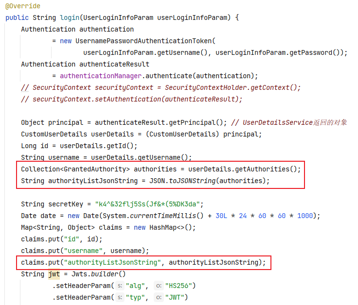
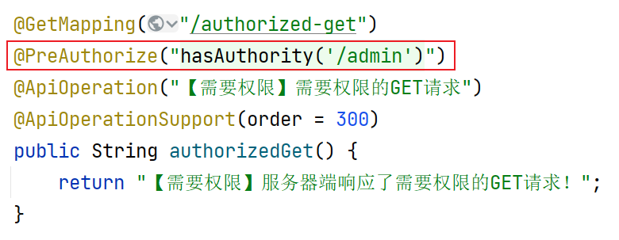

# 处理解析JWT时可能出现的异常

由于当前在Filter中解析JWT，而全局异常处理器只能处理Controller抛出的异常，所以，本次处理异常不可以使用全局异常处理器，则可以使用传统的`try...catch`语法进行捕获并处理：

```java
// 尝试解析JWT
response.setContentType("application/json; charset=utf-8");
String secretKey = "k4^&32flj5Ss(Jf&*(5%DK3da";
Claims claims = null;
try {
    claims = Jwts.parser()
            .setSigningKey(secretKey)
            .parseClaimsJws(jwt)
            .getBody();
} catch (SignatureException e) {
    String message = "非法访问！";
    JsonResult jsonResult = JsonResult.fail(ServiceCode.ERR_JWT_SIGNATURE, message);
    String jsonResultString = JSON.toJSONString(jsonResult);
    PrintWriter printWriter = response.getWriter();
    printWriter.println(jsonResultString);
    printWriter.close();
    return;
} catch (MalformedJwtException e) {
    String message = "非法访问！";
    JsonResult jsonResult = JsonResult.fail(ServiceCode.ERR_JWT_MALFORMED, message);
    String jsonResultString = JSON.toJSONString(jsonResult);
    PrintWriter printWriter = response.getWriter();
    printWriter.println(jsonResultString);
    printWriter.close();
    return;
} catch (ExpiredJwtException e) {
    String message = "您的登录信息已过期，请重新登录！";
    JsonResult jsonResult = JsonResult.fail(ServiceCode.ERR_JWT_EXPIRED, message);
    String jsonResultString = JSON.toJSONString(jsonResult);
    PrintWriter printWriter = response.getWriter();
    printWriter.println(jsonResultString);
    printWriter.close();
    return;
} catch (Throwable e) {
    log.debug("全局异常处理器开始处理Throwable");
    log.debug("异常跟踪信息如下：", e);
    String message = "服务器忙，请稍后再试！【同学们，看到这句时，你应该检查服务器端的控制台，并在JwtAuthorizationFilter中补充catch代码块进行处理】";
    JsonResult jsonResult = JsonResult.fail(ServiceCode.ERROR_UNKNOWN, message);
    String jsonResultString = JSON.toJSONString(jsonResult);
    PrintWriter printWriter = response.getWriter();
    printWriter.println(jsonResultString);
    printWriter.close();
    return;
}
```

# 正确的使用当事人

Spring Security并不关心你使用什么类型的当事人，你可以按需使用任何数据类型作为当事人，并且，在Controller中，可以使用`@AuthenticationPrincipal`注解来注入当事人（根据`SecurityContext`中的认证信息的当事人类型来注入参数）。

可以在`tmall-common`中（因为各子模块项目均可能需要使用）自定义当事人类型：

```java
@Data
public class CurrentPrincipal implements Serializable {

    /**
     * 当事人ID
     */
    private Long id;
    /**
     * 当事人用户名
     */
    private String username;

}
```

然后，创建认证信息时，存入自定义的当事人对象：


后续，当Controller需要识别当事人时，注入即可，例如：


# 处理用户的权限

在“根据用户名查询用户的登录信息”功能中，必须查询出此用户对应的权限列表，需要执行的SQL语句大致是：

```sql
SELECT
    account_user.id,
    account_user.username,
    account_user.password,
    account_user.enable,
    account_permission.value
FROM account_user
LEFT JOIN account_user_role ON account_user.id=account_user_role.user_id
LEFT JOIN account_role_permission ON account_user_role.role_id=account_role_permission.role_id
LEFT JOIN account_permission ON account_role_permission.permission_id=account_permission.id
WHERE username='root';
```

在`UserLoginInfoVO`类中添加“权限列表”属性：


查询数据库中的数据时，需要将用户的权限列表也查出来：

```xml
<?xml version="1.0" encoding="UTF-8" ?>
<!DOCTYPE mapper PUBLIC "-//mybatis.org//DTD Mapper 3.0//EN" "http://mybatis.org/dtd/mybatis-3-mapper.dtd">

<mapper namespace="cn.tedu.tmall.passport.dao.persist.mapper.UserMapper">

    <!-- UserLoginInfoVO getLoginInfoByUsername(String username); -->
    <select id="getLoginInfoByUsername" resultMap="LoginInfoResultMap">
        SELECT
            account_user.id,
            account_user.username,
            account_user.password,
            account_user.enable,
            account_permission.value
        FROM account_user
        LEFT JOIN account_user_role ON account_user.id=account_user_role.user_id
        LEFT JOIN account_role_permission ON account_user_role.role_id=account_role_permission.role_id
        LEFT JOIN account_permission ON account_role_permission.permission_id=account_permission.id
        WHERE username=#{username}
    </select>

    <resultMap id="LoginInfoResultMap" 
               type="cn.tedu.tmall.passport.pojo.vo.UserLoginInfoVO">
        <id column="id" property="id"/>
        <result column="username" property="username"/>
        <result column="password" property="password"/>
        <result column="enable" property="enable"/>
        <collection property="permissions" ofType="java.lang.String">
            <constructor>
                <arg column="value"/>
            </constructor>
        </collection>
    </resultMap>

</mapper>
```

在`UserDetailsService`中返回的`UserDetails`中需要包含权限列表：


验证登录成功后，向JWT中存入权限列表，注意：不要将权限列表直接存入，否则，后续解析时将无法正确的反序列化，应该将权限列表生成为JSON格式的字符串，后续解析时将JSON字符串反序列化为原本的对象！



过滤器中，从JWT中获取权限列表：


# 基于方法的权限检查

首先，需要在Spring Security的配置类上开启基于方法的权限检查：


然后，在需要检查权限的方法上，使用`@PreAuthorize`注解来配置所需的权限：

