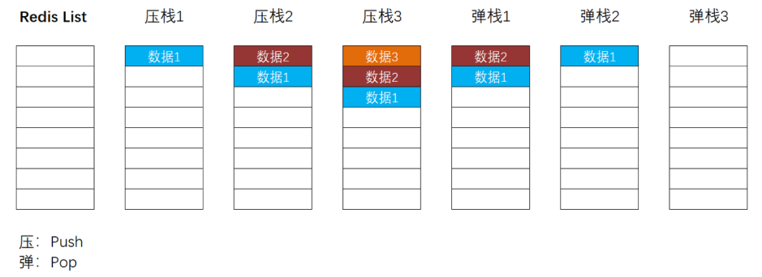
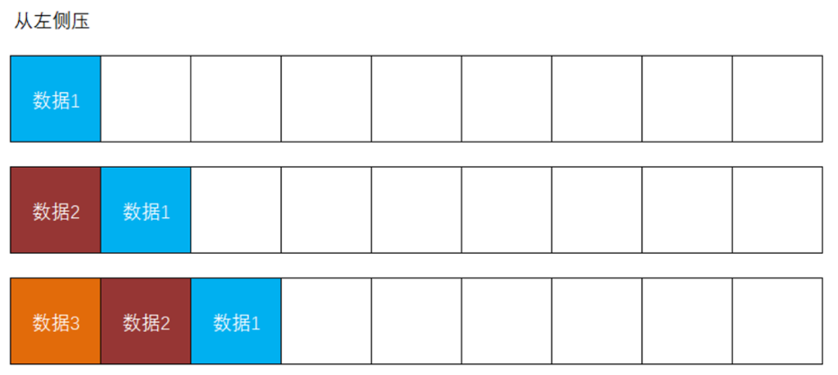
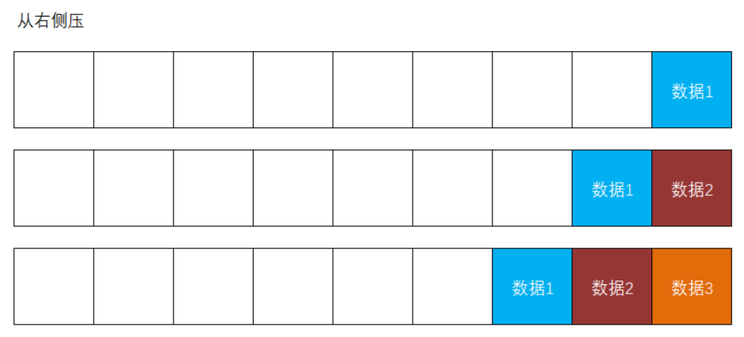
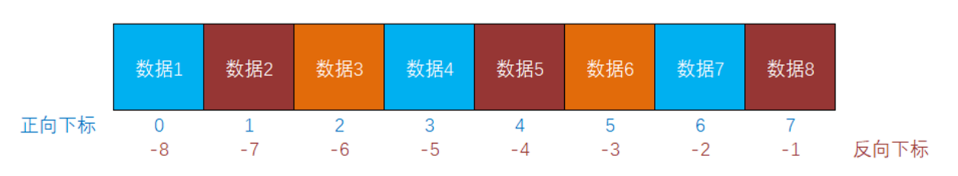

# 关于SSO

**SSO** = **S**ingle **S**ign **O**n，单点登录，表现为在集群或分布式系统中，客户端只需要在某1个服务上登录，接下来，无论访问到集群中的哪个服务，都可以被识别身份！

单点登录的常用实现手段有：

- 使用Session并共享Session：使用1台或多台专门的服务器用于存放Session数据，所有的应用服务器都从专门的Session服务器上读写Session
- 使用Token机制：每个应用服务器上都需要有相同的解析Token的程序代码

基于当前项目，如果需要在`tmall-admin-mall`中识别客户端的身份（客户端携带了JWT发起请求），则需要：

- 添加依赖：`spring-boot-starter-security`、`fastjson`、`jjwt`
- 复制`JwtAuthorizationFilter`
- 复制`SecurityConfiguration`
  - 可以删除配置`PasswordEncoder`的`@Bean`方法
  - 可以删除配置`AuthenticationManager`的`@Bean`方法
  - 应该调整“白名单”
- 复制自定义的JWT配置

完成后，由于在`tmall-admin-mall`项目中添加了`spring-boot-starter-security`，只要不在“白名单”中的请求都是需要通过认证的，只需要携带在`tmall-passport`项目中登录时得到的JWT，在`tmall-admin-mall`项目中也可以被识别身份，将视为“已登录”（或“已通过认证”）的状态！

# 关于复杂请求的跨域访问

当客户端提交请求时，如果请求头中包括特定的属性（例如`Authorization`等），则此请求会被视为复杂请求！

当客户端尝试提交复杂请求时，浏览器会执行“预检（PreFlight）”，即默认先对请求路径提交`OPTIONS`类型的请求，如果此请求被允许，则会自动提交原本尝试提交的请求，如果被拒绝，则不会提交原本尝试提交的请求！

在使用Spring Security时，默认情况下，不允许客户端提交跨域的复杂请求！如果要允许，可以：

- 在Spring Security的配置类中，调用`HttpSecurity`对象的`cors()`方法，即可启用Spring Security的`CorsFilter`，将对复杂请求的预检进行放行
- 在Spring Security的配置类中，调用`HttpSecurity`对象来配置请求授权，对`OPTIONS`类型的请求放行即可

注意：浏览器会对复杂请求的预检结果进行缓存，如果此前预检通过，则后续请求时不再执行预检！

# 关于Redis

Redis是一款基于内存的、使用K-V结构存储数据的NoSQL非关系型数据库。

> 数据库：数据的仓库，只要能够实现数据的读写，这类的软件都可以称之为数据库，通常，在没有特定的修饰的表达中，泛指“关系型数据库”。
>
> 非关系型数据库：对所有的数据一视同仁，并不表现数据之间的关系。
>
> NoSQL：No SQL / No Operation SQL，不使用SQL语句操作数据库的数据。
>
> 基于内存的：Redis的数据是直接存储在内存中的。注意：Redis会自动的将所管理的数据同步到磁盘上，并且，在每次启动时都会自动将磁盘上的数据同步到内存中，所以，即使计算机重启或断电，Redis中的数据基本上不会丢失。

由于Redis是基于内存的，所以，Redis的读写效率非常高！

Redis的主要作用是“缓存数据”，通常的表现为：将关系型数据库（例如MySQL）中的数据取出，并存入到Redis中，后续，当需要读取相关数据时，不再从关系型数据库中读取，而是优先从Redis中读取！

由于Redis是基于内存的，所以，读写效率远高于基于磁盘的关系型数据库，Redis的查询效率非常高，单次查询耗时更短，就可以承受更大的访问量，并减少了对关系型数据库的访问，从而起到保护关系型数据库的作用！


# Redis中的常用命令

当登录Redis客户端（命令提示符变成`127.0.0.1>6379`后），可以执行Redis的相关命令：

- `set KEY VALUE`：存入数据，例如`set username1 tom`，如果KEY不存在，则表示新增数据，如果KEY已经存在，则会覆盖原有的数据，所以，`set`命令既是新增数据的命令，也是修改数据的命令
- `get KEY`：取出数据，例如`get username1`，如果KEY存在，则返回对应的VALUE，如果KEY不存在，则返回`(nil)`，相当于Java中的`null`

- `keys PATTERN`：根据模式（`PATTERN`）获取KEY的列表，例如`keys username1`，如果存在匹配模式的KEY，则返回这些KEY的集合，如果不存在，则返回`(empty list or set)`，在使用模式时，可以使用`*`作为通配符，例如`keys username*`，将返回所有以`username`作为前缀的KEY，甚至，你可以使用`keys *`查询所有KEY
  - **注意：**在生产环境中，禁止使用此命令！

- `del KEY [KEY ...]`：根据若干个KEY（至少1个）删除数据，将返回受影响的数据量，例如执行`delete age1`，当此KEY存在时，将返回`(integer) 1`，当此KEY不存在时，将返回`(integer) 0`
- `flushdb`：清空当前数据库

更多命令可参考：https://www.cnblogs.com/antLaddie/p/15362191.html

# Redis中的数据类型

Redis中的经典数据类型有5种，分别是：string（一般值，例如字符串、数值等可以直接字面表示的） / list / set / hash（对象，对应Java语句中的`Map`） / zset

另外，还有：bitmap / hyperloglog / Geo / Stream

# Redis中的list类型

在Redis中，list类型的数据使用的是先进后出、后进先出的栈结构：



在学习Redis时，应该把Redis中的栈结构水平旋转90度来理解！

在操作Redis中的list数据时，可以从左侧进行压栈或弹栈的操作，例如：



也可以从右侧进行压栈或弹栈的操作，例如：



当从Redis中读取list的数据时，**始终从左至右读取数据**，通常，为了符合绝大多数开发者的使用习惯，会采“从右侧压入数据”的做法。

在Redis的list中，每个数据都有2个下标值，分别是从左至右、从0开始顺序递增的下标，和从右至左、从-1开始顺序递减的下标，例如：



注意：在获取list的数据区间时，必须保证start在end的左侧！

# Redis编程

在基于Spring Boot的项目中，实现Redis编程需要添加`spring-boot-starter-data-redis`依赖项。

然后，需要使用`RedisTemplate`工具类的API实现Redis编程，通常会在配置类中使用`@Bean`方法来配置`RedisTemplate`，则后续可以在任何组件类中自动装配`RedisTemplate`，然后调用相关访问来访问数据。

关于配置类：

```java
package cn.tedu.tmall.admin.mall.config;

import org.springframework.context.annotation.Bean;
import org.springframework.context.annotation.Configuration;
import org.springframework.data.redis.connection.RedisConnectionFactory;
import org.springframework.data.redis.core.RedisTemplate;
import org.springframework.data.redis.serializer.RedisSerializer;

import java.io.Serializable;

@Configuration
public class RedisConfiguration {

    @Bean
    public RedisTemplate<String, Serializable> redisTemplate(
            RedisConnectionFactory redisConnectionFactory) {
        RedisTemplate<String, Serializable> redisTemplate = new RedisTemplate<>();
        redisTemplate.setConnectionFactory(redisConnectionFactory);
        redisTemplate.setKeySerializer(RedisSerializer.string());
        redisTemplate.setValueSerializer(RedisSerializer.json());
        return redisTemplate;
    }

}
```


