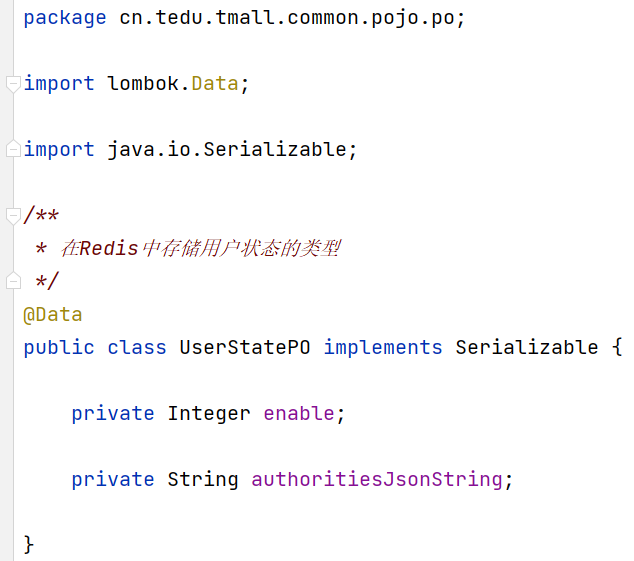
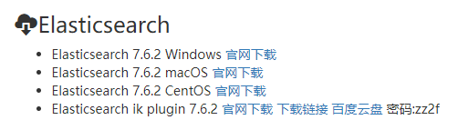

# 关于单点登录的补充实现

## 向JWT中存入的数据调整为：用户ID、用户名、IP地址、浏览器信息

- **tmall-passport: IUserService**


- **tmall-passport: UserServiceImpl**


- **tmall-passport: UserController**


## 向Redis中存入数据：权限列表、启用状态

- 添加Redis编程的依赖项及`hutool`的依赖项

- **tmall-common**：新增PassportCacheConsts

  

- **tmall-common**：UserStatePO

  

- **tmall-passport**：IUserCacheRepository

  

- **tmall-passport**：UserCacheRepositoryImpl

  

- **tmall-passport**：UserServiceImpl

  

## 更新解析JWT的代码

- **tmall-passport**：IUserCacheRepository

  

- **tmall-passport**：UserCacheRepositoryImpl

  

- **tmall-passport**：JwtAuthorizationFilter

  

  

  

# 登录成功的响应结果

当用户登录成功后，服务器端向客户端响应的数据应该包括：

- id：备用
- 用户名：用于显示在客户端的界面
- 头像：用于显示在客户端的界面
- JWT
- 权限列表：用于客户端程序判断是否应该显示某些内容，例如是否显示某个菜单项、某个按钮等

则应该创建`UserLoginResultVO`类，封装以上属性：

```java
@Data
public class UserLoginResultVO implements Serializable {
    private Long id;
    private String username;
    private String avatar;
    private String token;
    private String[] authorities;
}
```

在`IUserService`中的登录方法的返回值类型改为以上创建的`UserLoginResultVO`类型，并同步调整实现类中的方法的返回值。

然后：

- 在`UserLoginInfoVO`类中添加`String avatar`属性
- 在`UserMapper.xml`中配置查询的字段列表与结果集，需要查询头像数据

- 在`CustomUserDetails`中添加`String avatar`属性，并调整构造方法，通过构造方法的参数为此属性赋值
- 在`UserDetailsServiceImpl`中创建`CustomUserDetails`时传入头像值（来自`UserLoginInfoVO`对象）
- 在`UserServiceImpl`中：
  - 从`CustomUserDetails`中取出头像，用于创建`UserLoginResultVO`对象
  - 创建长度与前序权限列表相同的`String[]`，并遍历前序得到的权限列表，为`String[]`的各元素赋值
  - 创建`UserLoginResultVO`对象，作为当前方法的返回值

最后，调整`UserController`中的登录方法，向客户端响应Service中返回的对象即可。

# 【新】关于SSO

经过调整后，如果其它项目需要识别来访的客户端的身份，或检查权限，需要：

- 添加依赖：`spring-boot-starter-security`、`fastjson`、`jjwt`、`spring-boot-starter-data-redis`、`hutool`
- 复制`RedisConfiguration`
- 复制`IUserCacheRepository`及其实现类
- 复制`JwtAuthorizationFilter`
- 复制`SecurityConfiguration`
  - 可以删除配置`PasswordEncoder`的`@Bean`方法
  - 可以删除配置`AuthenticationManager`的`@Bean`方法
  - 应该调整“白名单”
- 复制自定义的JWT配置

# 查询商品列表

- 在项目的根包下创建`pojo.vo.GoodsListItemVO`类

- 在`GoodsMapper`接口中添加抽象方法：

  ```java
  List<GoodsListItemVO> list();
  
  List<GoodsListItemVO> listByCategory(Long categoryId);
  ```

- 在`GoodsMapper.xml`中配置以上抽象方法映射的SQL语句

- 测试以上完成的查询功能

- 在`IGoodsRepository`接口添加抽象方法：

  ```java
  PageData<GoodsListItemVO> list(Integer pageNum, Integer pageSize);
  
  PageData<GoodsListItemVO> listByCategory(Long categoryId, Integer pageNum, Integer pageSize);
  ```

- 在`GoodsRepositoryImpl`类中实现以上方法

- 测试以上完成的查询功能

- 在`IGoodsService`接口中添加抽象方法：

  ```java
  PageData<GoodsListItemVO> list(Integer pageNum);
  PageData<GoodsListItemVO> list(Integer pageNum, Integer pageSize);
  
  PageData<GoodsListItemVO> listByCategory(Long categoryId, Integer pageNum);
  PageData<GoodsListItemVO> listByCategory(Long categoryId, Integer pageNum, Integer pageSize);
  ```

- 在`GoodsServiceImpl`类中实现以上方法

- 测试以上完成的查询功能

- 在`GoodsController`中添加方法，用于接收并处理“查询商品列表”和“根据类别查询商品列表”这2种请求的2个方法

# 数据库中的索引

在关系型数据库中，索引（index）是一种单独的、物理层面的对数据库中的一列或多列的值进行排序检索的一种数据结构。

在关系型数据库中，查询数据的效率其实非常低下，在没有做任何优化处理的情况下，查询时，会将表中所有数据全部检查一遍，看每一条数据是否匹配查询条件，所以，数据量越大，查询耗时就越久！并且，数据在磁盘上并不是连接排列的，而是分散在硬盘的不同区域的，所以，进一步导致查询效率低下！

使用索引可以非常明显的提升查询效率！

如果需要手动创建索引，需要自行执行创建索引的SQL语句，其命令基本格式大致是：

```mysql
CREATE INDEX index_name ON table_name (field_name);
```

例如：

```mysql
CREATE INDEX idx_name ON mall_category (name);
```

提示：如果表中已经存在数据，数据量越大，创建索引的耗时就越久！

如果需要删除已经存在的索引，其命令基本格式大致是：

```mysql
DROP INDEX index_name ON table_name;
```

在创建索引时，MySQL会将对应的字段的数据进行排序，并在索引中记录下每条数据的位置信息，所以，索引相当于“书的目录”，后续，当需要根据此字段查询数据时，会先翻“书的目录”，找出数据对应的“页码”，并直接翻到对应的“那一页”，就可以把数据找出来了！所以，使用索引后，查询效率会非常高！

索引的本质是一种B+Tree结构（是一种树型结构）的数据，在MySQL中，InnoDB存储引擎中页的大小是16KB，如果使用BIGINT类型的主键，每个主键需要占用8Byte，在B+Tree中的指针是4~8Byte，所以，每个指针与主键形成1个B+Tree中的节点，每个节点最多占用16Byte，每页最少可以存储1024个节点，深度为3的B+Tree最少可以存储1024 * 1024 * 1024个节点，大约是1000 * 1000 * 1000 = 1000000000个节点（10亿），所以，每个B+Tree可以维护约10亿个节点，即10亿个“内容与页码”的对应关系，如果表中的数据量不超过约10亿条，都只需要执行3次IO操作，就可以找出数据的位置。

在数据库中，即使你没有显式的创建索引，某个字段的查询效率可能也非常高，是因为索引有多种：

- PRIMARY KEY：主键索引
- UNIQUE：唯一索引
- INDEX：普通索引
- FULLTEXT：全文索引

基于索引的数据结构的特性，在使用时，必须注意：

- 索引不会包含有NULL值的列
- 数据量非常少的表没有必要创建索引，索引也需要维护，并占用一定的存储空间
- 数据经常变化的字段不要创建索引，因为，数据的变化可能需要同步更新索引，导致写数据的效率降低
- 查询时需要计算字段的值时，索引是无效的（不会发挥作用），例如：`where age / 10 > 8`时，`age`列的索引就是无效的
- 左侧的模糊查询无法使用索引，因为索引是基于这一列的数据进行排序得到的，如果执行左侧模糊查询，则排序是无意义的，所有数据都需要被检查是否匹配
  - 在开发实践中，几乎不使用模糊查询

除了以上限制以外，不同的企业可能有更高的要求：

- 类别为`text`的字段不允许使用索引
- 类别为`varchar`且字段值可能很长的字段不允许使用索引


# 下次课前准备

请提前下载（不需要使用，不需要运行）Elasticsearch与Elasticsearch ik plugin：




