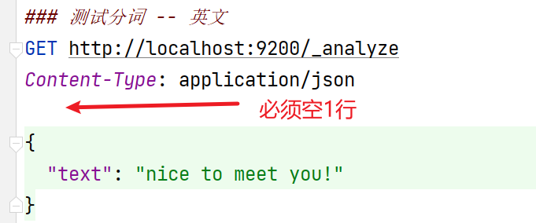

# 关于Elasticsearch

Elaticsearch是专门用于解决搜索问题的NoSQL的文档数据库。

无论使用哪种操作系统，只需要下载elasticsearch的压缩包并解压即可使用，需要注意，elasticsearch文件夹的各层级的父级文件夹的名称中不允许包含非ASCII码字符和空格！例如放在D盘根目录下：


执行`bin`目录下的`elasticsearch`即可启用Elasticsearch服务：


启动成功后，效果大致如下：


**注意：**在使用Elasticsearch的过程中，以上窗口不可关闭！

当启动成功后，你可以通过浏览器访问 http://localhost:9200，页面显示内容如下：


elasticsearch提供了一套基于RESTful的访问，你可以使用任何一种可以提交REST请求的工具来访问elasticsearch及其中的数据，例如常见的测试工具PostMan等。

或者，你也可以在IntelliJ IDEA中，使用HTTP Request进行访问：


在HTTP Request文件中编写需要提交的请求，然后，点击左侧的运行图标即可发起请求


# 使用elasticsearch分词

Elasticsearch之所以能够高效处理搜索，是因为它会将你的数据进行“分词”处理，即将一段文本拆成若干个文本，在执行搜索时，会尝试检查是否匹配“拆”出来的某个文本。

向 http://localhost:9200/_analyze 提交请求即可分词，并且，请求中必须包含请求参数，参数名称固定为`text`，整个请求的格式大致如下：



提示：在同一个`.http`文件中，可以编写多个请求，但是，后续的请求的代码必须使用 `###` 和前序的请求分开，不能只使用1个 `#`！

你也可以尝试对中文的句子进行分词，会发现，在默认情况下，Elasticsearch只能将中文中的每个字拆出来，并不能正确的处理各个词语！

示例代码：

```
### 测试分词 -- 中文
GET http://localhost:9200/_analyze
Content-Type: application/json

{
  "text": "很高兴认识你！"
}
```

可以在Elasticsearch中添加新的分词插件来解决以上问题，经典的中文分词插件就是ik分词器。

所有插件都应该放在Elasticsearch下的plugin文件夹下：


你需要将下载得到的ik分词器的压缩包解压出来，将解压得到的文件夹放在`plugins`文件夹下，而ik分词器的文件夹名称就叫`ik`即可：


**注意：**完成后，需要重启Elasticsearch（关了再打开）才可以应用新添加的分词器！

接下来，你就可以使用IK分词器对中文的句子进行分词！你需要在请求参数中通过`analyzer`属性来指定分词器，取值可以是IK分词器提供的`ik_smart`或`ik_max_word`，例如：

```
### 测试分词 -- 中文 -- ik_smart
GET http://localhost:9200/_analyze
Content-Type: application/json

{
  "analyzer": "ik_smart",
  "text": "很高兴认识你！"
}

### 测试分词 -- 中文 -- ik_max_word
GET http://localhost:9200/_analyze
Content-Type: application/json

{
  "analyzer": "ik_max_word",
  "text": "很高兴认识你！"
}
```

使用IK分词器时，可以自造词！例如：


# Elasticsearch文档数据库的相关概念

**索引（index / indices）**

- 相当于MySQL中的Database

**类型（type / types）**

- 相当于MySQL中的Table，可以自行创建“类型”，或者，如果不关心“类型”，使用 `_doc` 表示类型名
- ES本身并不注重“类型”的概念，甚至在较高版本（8.x或以上）基本已废弃此概念

**文档（document / documents）**

- 相当于MySQL中各数据表中一行行的数据
- 在ES中每个数据都是由JSON格式组织的

**字段（field / fields）**

- 相当于MySQL中的Column

# 基于RESTful访问Elasticsearch

## 操作汇总


## 添加文档

**添加文档（使用ES随机生成的ID值）**

请求格式：

```
POST http://localhost:9200/{索引名}/{类型名}
```

提示：添加文档时，如果索引不存在，会自动创建索引，如果类型不存在，会自动创建类型！

请求示例：

```
### 添加文档
POST http://localhost:9200/index_crud/_doc
Content-Type: application/json

{
  "id": 998,
  "title": "2023新茶上市，赔本大甩卖",
  "sort": 188
}
```

**添加文档（自行指定ID值）**

请求格式：

```
PUT http://localhost:9200/{索引名}/{类型名}/{文档ID}
```

请求示例：

```
### 添加文档（自行指定ID值）
PUT http://localhost:9200/index_crud/_doc/Tea9527
Content-Type: application/json

{
  "id": 999,
  "title": "2023老茶上市，卖得也相当不错",
  "sort": 199
}
```

## 删除

**根据ID删除文档**

请求格式：

```
DELETE http://localhost:9200/{索引名}/{类型名}/{文档ID}
```

请求示例：

```
### 根据ID删除文档
DELETE http://localhost:9200/index_crud/_doc/Tea9527
```

提示：如果尝试删除的文档不存在，将响应`404`错误！

**删除索引**

请求格式：

```
DELETE http://localhost:9200/{索引名}
```

请求示例：

```
### 删除索引
DELETE http://localhost:9200/index_crud
```

提示：如果尝试删除的索引不存在，将响应`404`错误！

## 修改文档

**修改文档（更新整篇文档）**

请求格式：

```
PUT http://localhost:9200/{索引名}/{类型名}/{文档ID}
```

请求示例：

```
### 修改文档（更新整篇文档）
PUT http://localhost:9200/index_crud/_doc/Tea9527
Content-Type: application/json

{
  "id": 999,
  "title": "2023老茶上市，卖得也相当不错",
  "sort": 199,
  "description": "这个老茶味道很好，强烈推荐！"
}
```

注意：以上做法将使用请求参数替换原有的整篇文档！

**修改文档（局部修改）**

请求格式：

```
POST http://localhost:9200/{索引名}/{类型名}/{文档ID}/_update
```

请求参数：

```json
{
	"doc": {
        需要更新的数据的参数
    }
}
```

请求示例：

```
### 修改文档（局部修改）
POST http://localhost:9200/index_crud/_doc/Tea9527/_update
Content-Type: application/json

{
  "doc": {
    "sort": 189,
    "description": "老茶和新茶味道还是挺不一样，要不，买个试试？"
  }
}
```

注意：如果请求参数中包含新的属性（原文档中没有的属性），也会更新成功，且在文档中新增新的属性！

## 查看文档

**查看某个索引中的所有文档**

请求格式

```
GET http://localhost:9200/{索引名}/_search
```

请求示例：

```
### 查看某个索引中的所有文档
GET http://localhost:9200/index_crud/_search
```

**根据ID访问文档**

请求格式

```
GET http://localhost:9200/{索引名}/{类型名}/{文档ID}
```

请求示例：

```
### 根据ID访问文档
GET http://localhost:9200/index_crud/_doc/yjEl3okBucTgSd_ILGK2
```

# Elasticsearch中的数据类型

在Elasticsearch中，各字段的值也是有数据类型的，大致为：

- 字符串类型：`text`、`keyword`
  - `text`类型在被处理时，默认会被分词
    - 默认
  - `keyword`类型在被处理时，默认不会被分词
- 数值类型：`byte`、`short`、`integer`、`long`、`float`、`double`等
- 布尔类型：`boolean`
- 日期类型：`date`

例如，准备一些测试数据：

| ID（id） | 标题（title）    | 简介（description） | 排序序号（sort） | 售价（price） |
| -------- | ---------------- | ------------------- | ---------------- | ------------- |
| 1        | 散装龙井         | 好喝又实惠          | 160              | 300           |
| 2        | 大红袍大礼包     | 性价比之王          | 190              | 688           |
| 3        | 龙井礼盒         | 送礼必备            | 130              | 888           |
| 4        | 精装陈年老普洱   | 收藏珍品            | 150              | 988           |
| 5        | 精装铁观音大礼包 | 家中常备            | 160              | 700           |

在使用Elasticsearch时，应该先手动创建索引，并确定此索引中的文档有哪些字段，及字段的数据类型！

请求格式：

```
### 自定义索引及其文档的属性和数据类型
PUT http://localhost:9200/{索引名}
Content-Type: application/json; charset=UTF-8

{
	"mappings": {
		"properties": {
			"{字段名1}": {
				"type": "{字段类型1}",
				"analyzer": "{分词器名称，仅用于text类型的字段}"
			},
			"{字段名2}": {
				"type": "{字段类型2}"
			},
			... ...
			"{字段名n}": {
				"type": "{字段类型n}"
			}
		}
	}
}
```

请求示例：

```
### 自定义索引及其文档的属性和数据类型
PUT http://localhost:9200/index_search
Content-Type: application/json; charset=UTF-8

{
  "mappings": {
    "properties": {
      "id": {
        "type": "long"
      },
      "title": {
        "type": "text",
        "analyzer": "ik_max_word"
      },
      "description": {
        "type": "keyword"
      },
      "sort": {
        "type": "long"
      },
      "price": {
        "type": "long"
      }
    }
  }
}
```

插入测试数据示例：

```
### 添加文档--测试数据1
PUT http://localhost:9200/index_search/_doc/1
Content-Type: application/json

{
  "id": 1,
  "title": "散装龙井",
  "description": "好喝又实惠",
  "sort": 160,
  "price": 300
}

### 添加文档--测试数据2
PUT http://localhost:9200/index_search/_doc/2
Content-Type: application/json

{
  "id": 2,
  "title": "大红袍大礼包",
  "description": "性价比之王",
  "sort": 190,
  "price": 688
}

### 添加文档--测试数据3
PUT http://localhost:9200/index_search/_doc/3
Content-Type: application/json

{
  "id": 3,
  "title": "龙井礼盒",
  "description": "送礼必备",
  "sort": 130,
  "price": 888
}

### 添加文档--测试数据4
PUT http://localhost:9200/index_search/_doc/4
Content-Type: application/json

{
  "id": 4,
  "title": "精装陈年老普洱",
  "description": "收藏珍品",
  "sort": 150,
  "price": 988
}

### 添加文档--测试数据5
PUT http://localhost:9200/index_search/_doc/5
Content-Type: application/json

{
  "id": 5,
  "title": "精装铁观音大礼包",
  "description": "家中常备",
  "sort": 160,
  "price": 700
}
```

# 搜索

**简单的搜索**

请求格式：

```
GET http://localhost:9200/{索引名}/_search?q={字段名:查询关键字}
```

请求示例：

```
### 根据关键字执行简单的搜索
GET http://localhost:9200/index_search/_search?q=title:龙井
```

**高级搜索**

```
### 添加文档--测试数据1
PUT http://localhost:9200/index_search/_doc/1
Content-Type: application/json

{
  "id": 1,
  "title": "散装龙井",
  "description": "好喝又实惠",
  "sort": 160,
  "price": 300
}

### 添加文档--测试数据2
PUT http://localhost:9200/index_search/_doc/2
Content-Type: application/json

{
  "id": 2,
  "title": "大红袍大礼包",
  "description": "性价比之王",
  "sort": 190,
  "price": 688
}

### 添加文档--测试数据3
PUT http://localhost:9200/index_search/_doc/3
Content-Type: application/json

{
  "id": 3,
  "title": "龙井礼盒",
  "description": "送礼必备",
  "sort": 130,
  "price": 888
}

### 添加文档--测试数据4
PUT http://localhost:9200/index_search/_doc/4
Content-Type: application/json

{
  "id": 4,
  "title": "精装陈年老普洱",
  "description": "收藏珍品",
  "sort": 150,
  "price": 988
}

### 添加文档--测试数据5
PUT http://localhost:9200/index_search/_doc/5
Content-Type: application/json

{
  "id": 5,
  "title": "精装铁观音大礼包",
  "description": "家中常备",
  "sort": 160,
  "price": 700
}
```

```
### 删除索引
DELETE http://localhost:9200/index_search

### 自定义索引及其文档的属性和数据类型
PUT http://localhost:9200/index_search
Content-Type: application/json; charset=UTF-8

{
  "mappings": {
    "properties": {
      "id": {
        "type": "long"
      },
      "title": {
        "type": "text",
        "analyzer": "ik_max_word"
      },
      "description": {
        "type": "keyword"
      },
      "sort": {
        "type": "long"
      },
      "price": {
        "type": "long"
      }
    }
  }
}

### 查看某个索引中的基本信息
GET http://localhost:9200/index_search

### 查看某个索引中的所有文档
GET http://localhost:9200/index_search/_search

### 简单搜索：根据关键字执行简单的搜索：搜索title中包含“龙井”的数据
GET http://localhost:9200/index_search/_search?q=title:龙井

### 简单搜索：根据关键字执行简单的搜索：搜索title中包含“精装”的数据，注意，包含“散装”或其它“?装”的数据也会出现在结果中
GET http://localhost:9200/index_search/_search?q=title:精装

### 简单搜索：根据关键字执行简单的搜索：搜索description中包含“收藏珍品”的数据
GET http://localhost:9200/index_search/_search?q=description:珍品

### 高级搜索：自定义query，在query属性下配置match属性，在match属性下再配置搜索的字段名与关键字
GET http://localhost:9200/index_search/_search
Content-Type: application/json

{
  "query": {
    "match": {
      "title": "龙井"
    }
  }
}

### 高级搜索：多条件搜索：自定义query，在query属性下配置bool属性，在bool属性下再配置must，must的值是数组，数组元素就是匹配规则，must下的多个规则必须同时匹配才能被搜索到
### 除了must以外，还可以是should，should只需要匹配其中任意1个条件即可
### 另外，还可以是must_not，即不允许是某种规则
### must >>> AND
### should >>> OR
### must_not >>> !=
GET http://localhost:9200/index_search/_search
Content-Type: application/json

{
  "query": {
    "bool": {
      "should": [
        {
          "match": {
            "title": "龙井"
          }
        },
        {
          "match": {
            "description": "送礼必备"
          }
        }
      ]
    }
  }
}

### 高级搜索：查询指定字段的数据，在query同级配置_source，此属性的值是数组，用于指定字段列表
GET http://localhost:9200/index_search/_search
Content-Type: application/json

{
  "query": {
    "match_all": {}
  },
  "_source": [
    "id",
    "title",
    "price"
  ]
}

### 高级搜索：指定排序，在query同级配置sort属性，在sort属性中配置排序规则，默认根据字段值升序排列，也可以配置order属性来指定规则，取值为desc时为降序
GET http://localhost:9200/index_search/_search
Content-Type: application/json

{
  "query": {
    "match_all": {}
  },
  "sort": [
    {
      "sort": {},
      "id": {
        "order": "desc"
      }
    }
  ]
}

### 高级搜索：分页搜索，在query同级配置from和size属性
GET http://localhost:9200/index_search/_search
Content-Type: application/json

{
  "query": {
    "match_all": {}
  },
  "sort": [
    {
      "id": {}
    }
  ],
  "from": 1,
  "size": 3
}

### 高级搜索：高亮显示，在query同级配置highlight属性进行配置，在highlight中配置fields属性，可以指定对应的字段
### 执行搜索后，匹配的结果中会出现同级的highlight数据，其中搜索的关键字默认会被<em>标签框住，后续在客户端拿到此结果后可以对<em>标签设计CSS样式
### 或者，在配置高亮搜索时，还可以在highlight标签下配置pre_tags和post_tags属性，以替换<em>和</em>标签
GET http://localhost:9200/index_search/_search
Content-Type: application/json

{
  "query": {
    "match": {
      "title": "精装"
    }
  },
  "highlight": {
    "fields": {
      "title": {}
    },
    "pre_tags": "<font style='color: red;'>",
    "post_tags": "</font>"
  }
}
```


